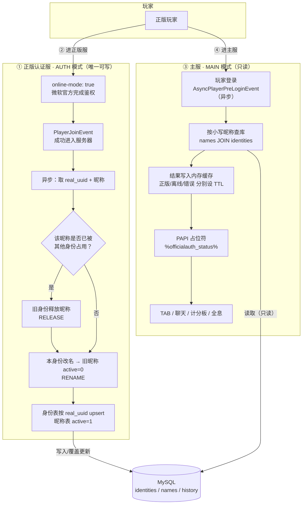
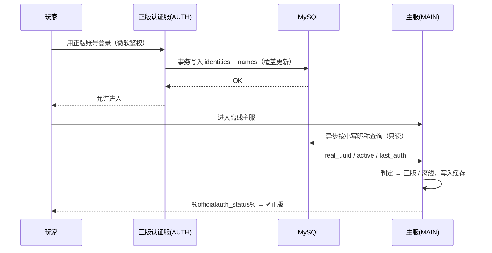

<div align="center">
  

> 主服离线模式（`online-mode: false`）也能**精准识别正版玩家**的解决方案。

用一台正版子服做唯一鉴权入口，认证结果落库到 MySQL；主服只读数据库，
通过 PAPI 占位符输出「✔正版 / ✘离线」，支持 TAB、聊天后缀、计分板、全息等全场景调用。

[](#)
[](#)
[](#)
[](#)
[](#)

---

## 目录

- [一、基础介绍](#一基础介绍)
  - [1.1 这是什么](#11-这是什么)
  - [1.2 解决什么问题](#12-解决什么问题)
  - [1.3 核心特性](#13-核心特性)
  - [1.4 运行环境](#14-运行环境)
- [二、实现方案](#二实现方案)
  - [2.1 总体架构](#21-总体架构)
  - [2.2 数据模型：账号-身份链](#22-数据模型账号-身份链)
  - [2.3 实现逻辑图](#23-实现逻辑图)
  - [2.4 业务流程](#24-业务流程)
  - [2.5 关键技术点](#25-关键技术点)
- [三、用户使用手册](#三用户使用手册)
  - [3.1 安装部署](#31-安装部署)
  - [3.2 配置速查](#32-配置速查)
  - [3.3 功能开关](#33-功能开关)
  - [3.4 指令](#34-指令)
  - [3.5 占位符](#35-占位符)
  - [3.6 认证成功提示（正版认证服）](#36-认证成功提示正版认证服)
  - [3.7 场景示例](#37-场景示例)
  - [3.8 常见问题](#38-常见问题)
  - [3.9 排错指南](#39-排错指南)
- [四、构建与开发](#四构建与开发)
- [五、项目结构](#五项目结构)

---

# 一、基础介绍

## 1.1 这是什么

**OfficialAuthentication** 是一个 Minecraft 服务端插件（单个 jar，双模式运行），用于在
**离线模式主服**上准确区分「正版玩家」与「离线玩家」。

它不做任何对外 HTTP 请求，不调用公开 API，只依赖一台你自己掌控的 MySQL：

```
正版子服（鉴权，唯一可写） ──写──▶ MySQL ◀──读── 主服（识别展示，只读）
```

## 1.2 解决什么问题

Minecraft 服务端 `online-mode: false` 时不会向微软验证账号，所有玩家都是「离线身份」，
于是出现这些麻烦：

| 痛点 | 后果 |
|---|---|
| 主服无法识别正版 | 正版玩家没有专属标签、称号、权限区分 |
| 离线 UUID 是昵称算出来的 | 换台机器/改个名字就能伪装成别人 |
| 想用正版服做鉴权 | 但正版服和主服数据不通，玩家进主服就「变回离线」 |
| 直接查 Mojang API | 有 IP 封禁、限流、超时风险，且主线程容易卡死 |

**OfficialAuthentication 的做法**：让玩家去一次正版子服完成微软鉴权，
把「正版 UUID ↔ 昵称」的绑定关系写进数据库，主服只读这份数据来展示标签。

## 1.3 核心特性

- **双模式单插件**：同一份 jar，配置成 `AUTH`（正版认证服）或 `MAIN`（主服）
- **账号-身份链**：以**正版 UUID 为根主键**，同一个微软账号无论怎么改名，
  永远只有**一条**正版身份；旧 ID 不再占用正版身份
- **旧 ID 直接当离线**：改名后旧 ID 的占位符与陌生玩家完全一致，不泄露原身份信息
- **绑定一次永久有效**：默认不做过期判定，不需要定期回正版服重新认证
- **换 ID 即换绑**：用新 ID 进一次正版服，新 ID 自动绑定、旧 ID 自动变离线
- **绑定状态占位符**：`%officialauth_bound%` 输出 `✔已绑定` / `✘未绑定`，可用于区分「从未绑定」与「已绑定」
- **认证成功提示**：正版服绑定成功后弹出横屏标题 `✔正版账号绑定成功` + 聊天栏详细提示 + 音效，文案全可配置
- **全异步**：所有数据库操作都在独立线程池，主线程零阻塞；登录前异步预查询
- **三级缓存 + 定时清理**：正版/离线/错误分别设 TTL，退服清缓存，定时清历史流水
- **数据源唯一可信**：只有正版服能写库，主服强制只读（连清理、解绑命令都拒绝）
- **功能总开关**：有效期、身份链、缓存、识别、PAPI、指令、清理……任意单独开关
- **彩色控制台启动横幅**：支持 `&#RRGGBB` 十六进制，自动转终端 ANSI
- **占位符文案自由配置**：默认 `&#33DD66&l✔正版` / `&#9E9E9E&l✘离线`，支持 emoji

## 1.4 运行环境

| 项目 | 要求 |
|---|---|
| 服务端 | Paper / Spigot 1.21+ |
| Java | 21 |
| 数据库 | MySQL 5.7+ / MariaDB 10.2+ |
| 前置插件 | PlaceholderAPI 2.11+（主服必需，认证服可选） |
| 建议搭配 | TAB、DeluxeChat、HolographicDisplays 等支持 PAPI 的插件 |

---

# 二、实现方案

## 2.1 总体架构

两台服务端 + 一个数据库，**写读分离**：

| 角色 | online-mode | 插件模式 | 权限 |
|---|---|---|---|
| 正版认证服（子服） | `true` | `AUTH` | 唯一**可写**，负责鉴权与落库 |
| 主服（游戏服） | `false` | `MAIN` | **只读**，负责识别与展示 |

```
                    ┌──────────────────┐
                    │      玩家        │
                    └───┬──────────┬───┘
      ① 进正版服（微软官方鉴权）   ③ 进主服（离线）
                        │          │
┌───────────────────────▼───┐  ┌────▼─────────────────────────────┐
│  正版认证服  AUTH          │  │  主服  MAIN                       │
│  online-mode: true        │  │  online-mode: false               │
│  server.mode: AUTH        │  │  server.mode: MAIN                │
│                           │  │                                   │
│  玩家成功进入              │  │  登录前异步预查询                  │
│   ↓ 异步                  │  │   ↓ 按小写昵称查库（只读）         │
│  取 real_uuid + 昵称      │  │  结果写入内存缓存                  │
└──────────┬───────────────┘  └────┬──────────────────────────────┘
           │ ② 覆盖更新（唯一写入口）   │ ④ 读取
           ▼                        ▼
   ┌────────────────────────────────────────────────┐
   │                  MySQL                         │
   │  officialauth_identities  real_uuid  (主键)     │
   │  officialauth_names       name_lower (主键)     │
   │  officialauth_history     认证事件流水           │
   └────────────────────────────────────────────────┘
                        ▲
                        │ ⑤ PAPI 占位符输出
              %officialauth_status% → ✔正版 / ✘离线
              供 TAB / 聊天 / 计分板 / 全息 调用
```

## 2.2 数据模型：账号-身份链

**核心设计：以正版 UUID 为根主键，昵称只是链上的一个节点。**

如果以「昵称」为主键，玩家改名后会产生**两条独立的正版记录**，旧 ID 依然显示正版，
无法区分「同一个人的曾用名」和「另一个人现在用了这个名字」。
因此这里把身份和昵称拆成两张表：

```
                    identities（身份 = 根）
        ┌───────────────────────────────────────────┐
        │  real_uuid        正版UUID   ← 主键        │
        │  current_name     当前昵称                 │
        │  first_auth       首次认证时间              │
        │  last_auth        最后认证时间              │
        └───────────────────┬───────────────────────┘
                            │ 1 : N
        ┌───────────────────▼───────────────────────┐
        │  names（昵称链）                            │
        │  name_lower       小写昵称   ← 主键        │
        │  real_uuid        归属身份                 │
        │  active           1=当前昵称 / 0=旧昵称     │
        │  detached_at      脱离时间                 │
        └───────────────────────────────────────────┘
```

同一个微软账号（`real_uuid = U`）改名前后的形态：

```
微软账号 U
   ├── PlayerA   active = 0   ← 旧 ID, 主服显示 ✘离线
   └── PlayerB   active = 1   ← 当前 ID, 主服显示 ✔正版
```

| 表 | 作用 | 字段 |
|---|---|---|
| `officialauth_identities` | 正版身份（唯一） | `real_uuid` PK、`current_name`、`current_name_lower`、`first_auth`、`last_auth` |
| `officialauth_names` | 昵称链（一条昵称同时只属于一个身份） | `name_lower` PK、`name_display`、`real_uuid`、`first_seen`、`last_seen`、`active`、`detached_at` |
| `officialauth_history` | 认证事件流水 | `id`、`real_uuid`、`name_lower`、`name_display`、`event`(AUTH/RENAME/RELEASE/UNLINK)、`time` |

> 表前缀由 `database.table-prefix` 配置，插件启动时自动建表。

## 2.3 实现逻辑图



时序视角（一次完整的绑定 → 识别）：



## 2.4 业务流程

### 流程 1：正版认证（AUTH 服）

1. 正版玩家用正版账号进入正版认证服，服务端完成微软鉴权
2. 玩家成功进入后，插件异步抓取 `正版UUID + 昵称`
3. 开启事务：检查该昵称是否被其他身份占用 → 检查本身份是否改名
4. `identities` 按 `real_uuid` 覆盖更新，`names` 按小写昵称落库并置 `active=1`
5. 写入 `history` 流水（AUTH / RENAME / RELEASE）

### 流程 2：主服识别展示（MAIN 服）

1. 任意玩家进入主服
2. `AsyncPlayerPreLoginEvent`（本来就是异步线程）按小写昵称查库
3. 结果写入内存缓存（正版结果缓存久，离线结果缓存短）
4. PAPI 占位符输出状态，供 TAB / 聊天 / 计分板 / 全息调用
5. 玩家退服时清掉该玩家的缓存

### 流程 3：换 ID（重点）

```
① ID-A 进正版服 → 绑定，主服显示 ✔正版（永久有效，不需要再认证）
② 玩家换成 ID-B
③ 用 ID-B 进一次正版服
      → names(id-b).active = 1        （新 ID 成为当前昵称）
      → names(id-a).active = 0        （旧 ID 变为旧昵称）
      → identities.current_name = ID-B
④ 主服：ID-B → ✔正版 ；ID-A → ✘离线
```

> ⚠️ 换 ID 后**必须用新 ID 进一次正版服**。主服是离线模式，无法自行确认新 ID 的归属。

## 2.5 关键技术点

| 技术点 | 实现方式 |
|---|---|
| **防主线程卡顿** | 独立 DB 线程池（`server.db-threads`）；所有 SQL 异步；登录前预查询也在异步线程 |
| **数据源唯一性** | `auth.allow-main-write: false`（默认）时主服拒绝一切写操作，含 `unlink` / `cleanup` |
| **防昵称冒充** | 旧 ID 直接按离线处理，不暴露原正版 UUID / 认证时间 / 昵称链；可选开启过期判定 |
| **查库压力** | 三级 TTL 缓存（正版 / 离线 / 错误）+ 同名并发查询合并（in-flight 去重）+ 定时清扫 |
| **大小写同名** | 统一用 `name_lower`（小写昵称）检索，并用它做昵称表主键 |
| **并发抢占昵称** | 事务 + `SELECT ... FOR UPDATE`，遇到死锁/锁等待超时自动重试一次 |
| **无外部依赖风险** | 不发 HTTP 请求，不调 Mojang API，无封 IP / 限流问题 |
| **热重载** | `/oauth reload` 可重载配置、功能开关、指令注册；数据库连接参数变化时会自动重建连接池 |

---

# 三、用户使用手册

## 3.1 安装部署

### 步骤

1. 从 [Releases](../../releases) 下载 `OfficialAuthentication-x.x.x.jar`
2. 放进**正版认证服**和**主服**两边的 `plugins/` 目录
3. 两边的 `config.yml` 填**同一个数据库**配置
4. 正版认证服：`server.mode: AUTH`；主服：`server.mode: MAIN`
5. 确认 `server.properties`：认证服 `online-mode=true`，主服 `online-mode=false`
6. 装好 `PlaceholderAPI`（主服必需）
7. 重启服务端

启动成功后控制台会打印彩色横幅：

```
============================================================
  OfficialAuthentication v1.2.0   正版认证 · 主服识别
  服务器: Paper 1.21.11 | 运行模式: AUTH (正版认证服 · 唯一写库)
  online-mode: true | 数据库: 已连接 (127.0.0.1:3306/minecraft)
  认证有效期: 永久有效(不过期) | PlaceholderAPI: 已加载 | /zb 指令: /zb
  已启用: 正版认证写库, 身份链改名追踪, 旧昵称失效, 主服识别查询, ...
  已关闭: 认证有效期校验
============================================================
```

> **MySQL 驱动无需手动配置**：
> Paper 会用 `plugin.yml` 的 `libraries` 自动下载；
> Spigot 或其他不支持 `libraries` 的服务端，**插件会自己把 `mysql-connector-j` 下载到
> `plugins/OfficialAuthentication/libs/` 并加载**，同样开箱即用。
> 若服务器完全无法联网，手动把 `mysql-connector-j-x.x.x.jar` 放进该 `libs` 目录即可（插件会加载目录下所有 jar）。

### MySQL 驱动（插件自动处理）

不管用什么服务端，都**不需要手动改服务端配置**：

| 服务端 | 行为 |
|---|---|
| Paper | 由 `plugin.yml` 的 `libraries` 自动下载（首选） |
| Spigot / 其他 | 插件自己下载到 `plugins/OfficialAuthentication/libs/`，用独立类加载器加载 |
| 完全离线 | 手动把 `mysql-connector-j-x.x.x.jar` 放进该 `libs` 目录即可（目录下所有 jar 都会被加载） |

```yaml
database:
  driver:
    auto-download: true                                  # 服务端里找不到驱动时自动下载
    version: '8.4.0'
    repositories:                                        # 按顺序尝试
      - 'https://maven.aliyun.com/repository/public'
      - 'https://repo1.maven.org/maven2'
    timeout-ms: 15000
```

启动日志会明确告诉你走的哪种方式：

```
[正版认证] 使用服务端自带的 MySQL 驱动
[正版认证] 正在下载 MySQL 驱动: https://maven.aliyun.com/.../mysql-connector-j-8.4.0.jar
[正版认证] MySQL 驱动下载完成: plugins/OfficialAuthentication/libs/mysql-connector-j-8.4.0.jar
已加载插件自带 MySQL 驱动: com.mysql.cj.jdbc.Driver (8.4)
```

### 验收清单

- [ ] 认证服控制台出现 `MySQL 连接成功`
- [ ] 认证服出现 `已注册指令 /zb`
- [ ] 主服出现 `已注册 PlaceholderAPI 拓展`
- [ ] 用正版账号进一次认证服，数据库 `officialauth_names` 出现一行记录
- [ ] 主服执行 `/oauth info <你的ID>` 显示 `✔正版`

## 3.2 配置速查

### server

```yaml
server:
  mode: MAIN      # AUTH = 正版认证服(唯一写库) / MAIN = 主服(只读识别)
  db-threads: 2   # 数据库线程数
  debug: false    # 调试日志
```

### database

```yaml
database:
  host: 127.0.0.1
  port: 3306
  database: minecraft
  username: root
  password: 'your_password'
  table-prefix: 'officialauth_'   # 表前缀(自动建表)
  pool-size: 4                    # 连接池大小
  connection-timeout-ms: 5000     # 获取连接超时
  extra-params: 'useSSL=false&characterEncoding=utf8&allowPublicKeyRetrieval=true&serverTimezone=Asia/Shanghai'
  create-tables-on-start: true    # 启动时自动建表

  # MySQL 驱动自动加载（Spigot 等不支持 libraries 的服务端同样可用）
  driver:
    auto-download: true           # 服务端里找不到驱动时自动下载
    version: '8.4.0'
    repositories:                 # 按顺序尝试直到成功
      - 'https://maven.aliyun.com/repository/public'
      - 'https://repo1.maven.org/maven2'
    timeout-ms: 15000
```

### auth

```yaml
auth:
  expiry-enabled: false   # ★ 默认关闭: 绑定一次永久有效, 无需重新认证
  expire-days: 30         # 仅 expiry-enabled: true 时生效
  query-timeout-seconds: 5

  # 主服缓存
  cache-seconds: 120          # 正版结果缓存
  cache-offline-seconds: 20   # 离线结果缓存(短一点, 刚认证完能快速生效)
  cache-error-seconds: 10     # 查询失败缓存(防雪崩)
  cache-purge-minutes: 10     # 缓存清扫间隔

  max-history-names: 8         # 昵称链展示条数上限
  allow-main-write: false      # 主服是否允许写库(默认 false = 数据源唯一可信)
```

## 3.3 功能开关

全部集中在 `config.yml` 的 `features` 段，`false` = 关闭；改完 `/oauth reload` 立即生效。

| 开关 | 默认 | 关闭后的效果 |
|---|---|---|
| `auth-record` | true | 正版服不再写库（等于不认证） |
| `name-chain` | true | 关闭身份链：改名直接删掉旧昵称记录 |
| `legacy-name-invalidate` | true | 关闭后改名，旧 ID 依然显示正版 |
| `main-recognition` | true | 主服完全不查库，占位符与 `/zb` 一律离线 |
| `login-pre-query` | true | 不做登录前预查询（进服后首次查询才加载） |
| `cache` | true | 不使用缓存，每次请求都查库 |
| `cache-clear-on-quit` | true | 退服保留缓存直到 TTL 到期 |
| `name-history-fetch` | true | 不查询改名历史（省一次 SQL） |
| `placeholder-api` | true | 不注册 PAPI 占位符 |
| `zb-command` | true | 不注册 `/zb` 指令 |
| `cleanup` | true | 不执行定时清理 |

### 认证有效期（`auth` 段，默认关闭）

```yaml
auth:
  expiry-enabled: false   # 默认: 绑定一次永久有效
  expire-days: 30         # 改成 true 后才会生效
```

- `false`（默认）：认证一次永久正版；`%officialauth_expire_in%` 输出「永久」，`expire_days` 输出 `-`
- `true`：超过 `expire-days` 天未再进正版服 → 显示「已过期」、`bool` 为 false，需要重新进一次正版服刷新

### 旧 ID 的处理方式（`placeholder` 段）

```yaml
placeholder:
  legacy-as-offline: true   # 默认: 旧 ID 完全按离线处理, 不泄露原身份信息
```

## 3.4 指令

### 玩家指令 `/zb`

```
/zb            查询自己的认证状态(聊天框提示)
/zb <玩家>      查询他人(需要 officialauth.zb.others 权限)
```

- 指令名与别名可在 `command.names` 自定义：默认 `zb`、`zhengban`、`renzheng`
- 提示内容 = `command.messages`（一行一条），支持按状态覆盖：
  `messages-premium` / `messages-expired` / `messages-former` / `messages-offline`
- 消息里的可用占位符（本地即可用，无需 PAPI）：

  | 占位符 | 说明 |
  |---|---|
  | `%player%` | 被查询玩家名 |
  | `%status%` | 状态文本（带颜色，如 `✔正版`） |
  | `%bool%` / `%known%` | true / false |
  | `%bound%` / `%is_bound%` | 绑定状态：✔已绑定 / ✘未绑定 · true/false |
  | `%real_uuid%` / `%uuid%` / `%offline_uuid%` | 正版UUID / 正版或离线UUID / 离线UUID |
  | `%current_name%` | 该正版身份当前昵称 |
  | `%last_auth%` / `%first_auth%` | 最后 / 首次认证时间 |
  | `%expire_in%` / `%expire_days%` | 剩余有效期 |
  | `%names%` / `%names_count%` | 昵称链 / 数量 |
  | `%mode%` / `%error%` | `AUTH`·`MAIN` / 错误信息 |

配置示例：

```yaml
command:
  names: [ 'zb' ]
  messages:
    - '&#00E5FF&m        &r &#00E5FF&l正版认证信息 &m        '
    - '&#00E5FF▎ &#FFFFFF状态: %status%'
    - '&#00E5FF▎ &#FFFFFF正版身份: &#00E5FF%current_name%'
    - '&#8C8C8C▎ &#FFFFFF最后认证: %last_auth%'
  messages-premium:
    - '&#33DD66&l你已经认证正版 &#8C8C8C(身份: %current_name%)'
  messages-offline:
    - '&#9E9E9E你还没有完成正版认证'
    - '&#FFB300进入正版认证服即可自动认证'
```

### 管理指令 `/officialauth`（别名 `/oauth`、`/zbauth`）

权限：`officialauth.admin`（默认 OP）

| 子指令 | 说明 |
|---|---|
| `/oauth status` | 查看模式、数据库、缓存、功能开关状态 |
| `/oauth info <玩家>` | 查询认证信息（状态、UUID、时间、昵称链） |
| `/oauth history <玩家>` | 查看改名历史 |
| `/oauth unlink <玩家>` | 解除某昵称的正版绑定（需可写） |
| `/oauth cleanup` | 立即执行过期数据清理（需可写） |
| `/oauth reload` | 重载配置、功能开关、指令注册 |

### 权限节点

| 权限 | 默认 | 说明 |
|---|---|---|
| `officialauth.admin` | OP | 使用 `/officialauth` 管理指令 |
| `officialauth.zb` | 所有人 | 使用 `/zb` 查询自己 |
| `officialauth.zb.others` | OP | `/zb <玩家>` 查询他人 |

## 3.5 占位符

标识符：`officialauth`

| 占位符 | 输出 |
|---|---|
| `%officialauth_status%` | 状态文本，默认 `&#33DD66&l✔正版` / `&#9E9E9E&l✘离线` |
| `%officialauth_bool%` | `true` / `false`（只有正版为 true） |
| `%officialauth_ispremium%` | 同 `_bool%` |
| `%officialauth_known%` | 数据库里是否存在该昵称的记录 |
| `%officialauth_bound%` | **绑定状态**：`&#33DD66&l✔已绑定` / `&#9E9E9E&l✘未绑定`（已过期也算已绑定） |
| `%officialauth_isbound%` | 绑定状态布尔值 `true` / `false`（别名 `_is_bound%`、`_bound_bool%`） |
| `%officialauth_real_uuid%` | 正版原生 UUID（离线玩家为空） |
| `%officialauth_uuid%` | 正版 UUID；离线玩家返回离线 UUID |
| `%officialauth_offline_uuid%` | 该昵称计算的离线 UUID |
| `%officialauth_current_name%` | 该正版身份当前昵称 |
| `%officialauth_last_auth%` | 最后认证时间（`placeholder.date-format`） |
| `%officialauth_last_auth_raw%` | 最后认证时间戳 |
| `%officialauth_first_auth%` | 首次认证时间 |
| `%officialauth_expire_in%` | 剩余有效期（关闭有效期时输出「永久」） |
| `%officialauth_expire_days%` | 剩余天数 |
| `%officialauth_names%` | 昵称链（当前在前，旧昵称带 `(旧)`） |
| `%officialauth_names_count%` | 昵称数量 |
| `%officialauth_mode%` | 当前服务端角色 `AUTH` / `MAIN` |

### 颜色与 emoji

所有可配置文本（占位符文案、`/zb` 消息、`messages`、启动横幅）都支持三套写法，可混用：

| 写法 | 例子 |
|---|---|
| 传统 `&` 颜色码（Bukkit 原生） | `&a` `&c` `&6` `&f` … |
| 传统 `&` 格式码 | `&l` 加粗 `&o` 斜体 `&n` 下划线 `&m` 删除线 `&k` 随机 `&r` 重置 |
| 十六进制 | `&#33DD66` 或 `#33DD66` |

emoji 直接写在配置里即可：

```yaml
placeholder:
  premium: '&#33DD66&l✔正版'      # ✔正版（整段加粗）
  expired: '&#FFAA00&l✘已过期'
  former:  '&#8C8C8C&l✘旧昵称'
  offline: '&#9E9E9E&l✘离线'
  pending: '&#FFD700&l…查询中'
  bound:   '&#33DD66&l✔已绑定'    # %officialauth_bound%
  unbound: '&#9E9E9E&l✘未绑定'
```

> 若某个插件不兼容 `§x§R§R§G§G§B§B` 旧版十六进制形式，把文案换成 `&a&l✔正版` 即可。
> 若客户端字体显示不出 emoji，可换成 `√` `×` 或纯文字。

## 3.6 认证成功提示（正版认证服）

玩家在正版认证服**成功完成绑定**（写库成功）后，插件会自动发送：

1. **屏幕中央标题（横屏大字）**：`&#33DD66&l✔正版账号绑定成功`
2. **聊天栏提示**（可自定义多行、含 UUID / 时间 / 绑定状态等信息）
3. **音效**（可关闭）

```yaml
bind-notify:
  enabled: true
  # always = 每次成功认证都提示 / change = 首次绑定或换绑 / once = 仅首次绑定
  mode: always

  # 屏幕中央标题，留空不显示
  title: '&#33DD66&l✔正版账号绑定成功'
  subtitle: '&#FFFFFF%player% &8· &7主服将显示 %status%'
  fade-in: 10     # 淡入 tick (20 tick = 1 秒)
  stay: 50        # 停留 tick
  fade-out: 10    # 淡出 tick

  # 聊天栏消息，一行一条
  messages:
    - '&#00E5FF&m                                                  &r'
    - '&#33DD66&l✔ 正版账号绑定成功'
    - '&#8C8C8C▎ &#FFFFFF你已绑定 &#00E5FF%player% &#FFFFFF为正版账号'
    - '&#8C8C8C▎ &#FFFFFF正版UUID: &#8C8C8C%real_uuid%'
    - '&#8C8C8C▎ &#FFFFFF绑定时间: &#8C8C8C%bind_time% &#8C8C8C(%bind_state%)'
    - '&#8C8C8C▎ &#FFFFFF绑定状态: %bound% &#8C8C8C| 主服标识: %status%'
    - '&#8C8C8C▎ &#8C8C8C以后进入主服会自动显示正版标识, 无需重复认证'
    - '&#00E5FF&m                                                  &r'

  sound: 'ENTITY_PLAYER_LEVELUP'   # 留空则不播放；支持 entity.player.levelup 写法
  sound-volume: 1.0
  sound-pitch: 1.2
```

可用占位符：

| 占位符 | 说明 |
|---|---|
| `%player%` | 本次绑定的 ID |
| `%real_uuid%` | 正版原生 UUID |
| `%uuid%` | 正版 UUID（离线玩家为离线 UUID） |
| `%current_name%` | 当前绑定昵称 |
| `%previous_name%` | 换绑前的旧 ID（无则 `-`） |
| `%bind_time%` | 绑定时间 |
| `%bind_state%` | 首次绑定 / 换绑 / 刷新认证 |
| `%first_bind%` / `%renamed%` | `true` / `false` |
| `%status%` | 主服会显示的状态（`✔正版`） |
| `%bound%` | 绑定状态（`✔已绑定`） |
| `%expire_in%` / `%names%` | 有效期剩余 / 昵称链 |

另外支持按场景覆盖文案：`messages-new`（首次绑定）、`messages-renamed`（换绑），
留空则使用默认 `messages`。

## 3.7 场景示例

**TAB 前缀**

```yaml
# TAB 配置
header-footer: ...
player-list:
  - '%officialauth_status% &f%player%'
```

**聊天格式（DeluxeChat / ChatControl 等）**

```yaml
format: '%officialauth_status% &f%player% &7» &f{message}'
```

**计分板 / 全息（任意 PAPI 位）**

```
&f正版状态: %officialauth_status%
&f正版UUID: &7%officialauth_real_uuid%
```

**权限区分（基于 PAPI 的权限插件）**

```
# 只有正版才给 vip 权限
%officialauth_bool% == true
```

## 3.8 常见问题

<details>
<summary><b>「✔已绑定」和「✔正版」有什么区别？</b></summary>

- `%officialauth_status%`：当前**是否享有正版标识**（过期、旧昵称都会变成 ✘离线）
- `%officialauth_bound%`：这个账号**有没有绑定过**正版（已过期仍然显示 ✔已绑定）

所以可以用它把「从没认证过的新玩家」和「认证过但暂时失效的老玩家」区分开。
</details>

<details>
<summary><b>每次进正版服都会弹绑定成功提示吗？</b></summary>

由 `bind-notify.mode` 控制：

- `always`（默认）：每次成功认证都提示
- `change`：只有首次绑定或改名换绑时提示
- `once`：只有首次绑定时提示

不想让正版服弹提示就设 `bind-notify.enabled: false`。
</details>

<details>
<summary><b>需要定期回正版服重新认证吗？</b></summary>

不需要。默认 `auth.expiry-enabled: false`，绑定一次永久有效。
</details>

<details>
<summary><b>玩家改名后为什么旧 ID 显示离线？</b></summary>

这是设计行为：旧 ID 默认完全按离线处理（`placeholder.legacy-as-offline: true`），
不暴露原正版 UUID、认证时间和昵称链，避免旧 ID 被拿来冒用。
想恢复「旧昵称」标签：设 `legacy-as-offline: false`。
两种模式下 `/oauth info <旧ID>` 都能看到真实状态。
</details>

<details>
<summary><b>玩家刚在正版服认证完，主服还是离线？</b></summary>

离线结果缓存为 `auth.cache-offline-seconds`（默认 20 秒），到期自动刷新；
玩家重新进服会立即重查。
</details>

<details>
<summary><b>主服显示「…查询中」不消失？</b></summary>

说明查库超时或数据库未就绪。执行 `/oauth status` 查看数据库状态，检查 `database` 配置。
</details>

<details>
<summary><b>想手动去掉某人的正版标记？</b></summary>

在正版认证服执行 `/oauth unlink <玩家>`；
或把主服 `auth.allow-main-write` 临时设为 `true` 后再执行。
</details>

<details>
<summary><b>控制台出现 <code>←[38;2;0;229;255m</code> 乱码？</b></summary>

终端不支持 ANSI。把 `console.ansi` 改成 `false`（插件会自动去色），
或改用宝塔 / Windows Terminal 等现代终端。
</details>

<details>
<summary><b>主服 mode 配置写错会怎样？</b></summary>

启动日志会给出警告。`MAIN` 模式下所有写库操作都会被拒绝（安全优先），不会污染数据。
</details>

<details>
<summary><b>能改表前缀吗？</b></summary>

可以，`database.table-prefix` 支持字母、数字、下划线，插件会自动建表。
</details>

## 3.9 排错指南

| 现象 | 排查方向 |
|---|---|
| 启动报 `MySQL 驱动自动下载失败` | 服务器无法访问下载仓库：手动把 `mysql-connector-j-x.x.x.jar` 放进 `plugins/OfficialAuthentication/libs/`，或在 `database.driver.repositories` 换成可用镜像 |
| 启动报 `数据库初始化失败` | 检查 host / port / 账号 / 密码 / 库名；改完执行 `/oauth reload` |
| `/oauth status` 显示数据库 `未就绪` | 同上；确认 MySQL 允许该 IP 连接 |
| 认证服玩家进服后数据库无记录 | 确认 `server.mode: AUTH`；确认 `features.auth-record: true`；开 `server.debug` 看日志 |
| 主服永远离线 | 确认两边连的是同一个库、表前缀一致；确认 `features.main-recognition: true` |
| 占位符不解析 | 确认装了 PlaceholderAPI、控制台有「已注册 PlaceholderAPI 拓展」 |
| 改名后新 ID 不是正版 | 确认玩家用新 ID 重新进过一次正版认证服 |

开启调试日志：`server.debug: true`，会在控制台输出查询与写入细节。

---

# 四、构建与开发

```bash
mvn clean package
# 产物：target/OfficialAuthentication-1.2.0.jar
```

依赖：

| 依赖 | 版本 | 作用域 |
|---|---|---|
| `io.papermc.paper:paper-api` | 1.21.11-R0.1-SNAPSHOT | provided |
| `me.clip:placeholderapi` | 2.11.6 | provided |

- Java 21，UTF-8 编码
- 不 shade 任何第三方库；MySQL 驱动获取顺序：
  1. 服务端已有的驱动（Paper 的 `libraries` / 手动放入服务端）→ 走 `DriverManager`
  2. 插件自行下载或 `plugins/OfficialAuthentication/libs/` 下的驱动 → 用独立类加载器直接连接
- 连接池为内置轻量实现（`SimpleConnectionPool`），无额外依赖

热重载：`/oauth reload`（配置、功能开关、指令注册、连接池参数变化时自动重建连接池）

# 五、项目结构

```
OfficialAuthentication/
├── pom.xml
├── README.md
└── src/main/
    ├── resources/
    │   ├── plugin.yml              # 指令、权限、libraries(MySQL 驱动)
    │   └── config.yml              # 全部配置（含中文注释）
    └── java/com/mention/officialAuthentication/
        ├── OfficialAuthentication.java   # 主类：双模式装配 / 热重载 / 定时任务 / 启动横幅
        ├── config/
        │   ├── AuthConfig.java           # 配置模块（含功能开关）
        │   └── ServerMode.java           # AUTH / MAIN
        ├── db/
        │   ├── DatabaseManager.java      # 连接池管理 + 自动建表
        │   ├── SimpleConnectionPool.java # 内置轻量连接池
        │   └── AuthRepository.java       # 全部 SQL（异步、事务、身份链）
        ├── cache/
        │   ├── AuthCache.java            # 三级 TTL 缓存
        │   └── AuthService.java          # 缓存优先 + 并发查询去重
        ├── listener/
        │   └── PlayerListener.java       # 认证写库 / 预查询 / 退服清缓存
        ├── papi/
        │   └── OfficialAuthExpansion.java# %officialauth_xxx% 占位符
        ├── command/
        │   ├── OfficialAuthCommand.java  # /oauth 管理指令
        │   └── ZbCommand.java            # /zb 玩家提示（可配置文案）
        ├── model/
        │   ├── AuthResult.java / AuthStatus.java / NameEntry.java
        └── util/
            ├── PlaceholderValues.java / ColorUtil.java / TimeUtil.java
            └── Msg.java / Console.java / PapiBridge.java
```

---

---

## 许可

本项目采用 MIT License。

## 鸣谢

- [PlaceholderAPI](https://github.com/PlaceholderAPI/PlaceholderAPI)
- [PaperMC](https://papermc.io/)
